구글 서비스의 documentation 은 참 잘 되어있다고 느끼면서도.. 참 어렵게 만들었다는 생각이 늘 든다.  
그대로 따라하다보면 뭔가 잘 안되는 것도 있고, 이 페이지 참고하라.. 저 페이지 참고하라.. 하다보면 다시 원 페이지로 돌아오는.. 일종의 순환 문제를 겪게 된다 ㅋㅋㅋ
물론 내가 잘 못해서 이해를 잘 못하는 것도 있지만, 아무튼 나한테는 마냥 쉬운 문서는 아니다.  
Google Cloud Build 를 무작정 사용해보며 나름의 시행착오 끝에, 간단한 사용 방법을 여기다가 써보려 한다.


> **[클라우드 서비스의 사용법은 빠르게 바뀐다]**
>
> 아는 사람은 알겠지만, 클라우드 서비스의 사용법은 정말 빠르게 바뀐다.  
> 그래서인지, 사용법에 대해 정성을 들여 설명하는 블로그 글들이 잘 없는거 같기도 하다.  
> 시간이 지나, 사용법이 크게 바뀌면 이 글도 무용지물이 될 수 있다고 생각한다.  
> 이 글을 쓰는 시점은 2020.08.09 다.


## 0. 들어가며

요즘 CI/CD 툴을 뭘 써보면 좋을지 고민하고 있다.  
그렇다고 내가 Devops 엔지니어는 아니라, 막 전문적인 걸 써보기는 그렇고, 일단 가장 쉬워보이는 [Google Cloud Platform의 Cloud Build](https://cloud.google.com/cloud-build)를 사용해보기로 했다.

GCP Cloud Build 는 GCP 에서 제공하는 CI/CD 툴이다.
사용 과정을 간단히 설명하면 다음과 같다.

- 개발자는 별도의 `.yaml` 파일로 일련의 파이프라인을 표현한다.
    - 여기에는 도커 이미지 빌드, 푸시, 테스트, 배포 등등 하고 싶은 일을 넣으면 된다.
    - 이 `.yaml` 파일은 깃허브에 소스코드와 함께 위치해야 한다.
- GCP Cloud Build 페이지에서 트리거를 생성한다.
    - 트리거에서 어떤 브랜치에 어떤 요청이 왔을 때 어떤 `.yaml` 을 실행할 지 정할 수 있다.
    - 예를 들면 `master` 브랜치에 `push` 요청이 왔을 때 특정 트리거를 발동시킬 수 있다.

이제 이 과정을 하나씩 살펴보자.


## 1. 간단한 앱과 Dockerfile 준비

먼저 서비스 배포할 간단한 서버 앱을 만들어보자.  
나는 파이썬 유저라 flask 를 이용하였다.

```python
# app.py

from flask import Flask

app = Flask(__name__)

@app.route("/")
def hello_world():
    return "Hello, world!"

if __name__ == "__main__":
    app.run(debug=True, host="0.0.0.0", port=5000)
```

그리고 이제 이 앱을 컨테이너로 말을 Dockerfile 을 작성하자.

```dockerfile
# Dockerfile

FROM python:3.7.8-slim

MAINTAINER heumsi@gmail.com

RUN apt-get -y update && \
    apt-get install -y vim && \
    apt-get install -y telnet && \
    apt-get install -y wget

RUN python -m pip install --upgrade pip

COPY . /app
WORKDIR /app

ENTRYPOINT ["python"]
CMD ["app.py"]

EXPOSE 5000
```

이제 앱을 컨테이너로 띄울 준비가 되었다.


## 2. cloud build `.yaml` 작성

 `.yaml` 파일에 각 트리거에서 일어날 일련의 동작들을 적어줘야 한다.  


### CI (Continous Integration)

먼저 CI 에서 다음 작업을 하려고 한다.

- `app.py` 가 `black` 으로 잘 포매팅 되어있는지 확인한다.

이를 위해서는, 터미널에서 다음 커맨드를 입력하면 된다. (물론 `pip` 로 `black` 이 이미 설치되어있어야 한다.)

```bash
$ black --check app.py
All done! ✨ 🍰 ✨
1 file would be left unchanged.
```

이 과정을 `cloudbuild-ci.yaml` 이라는 파일에 담자.

```yaml
# cloudbuild-ci.yaml

steps:
  - name: docker.io/library/python:3.7
    id: Check code style
    entrypoint: /bin/sh
    args:
      - -c
      - >-
        pip install black==19.10b0 &&
        black --check app.py
```

이 파일을 간단히 해석하면 다음과 같다.

-  `steps` 
    - 파이프라인을 구성할 각 스텝들을 정의한다. 스텝들을 리스트 형태로 담는다.
    - 기본적으로 이 스텝들은 "순차적" 으로 진행된다.
- `name`
    - 각 `step` 들은 개별적인 컨테이너를 띄우는데 그 때 사용할 이미지다.
    - 나는 파이썬을 사용할 거라  `docker.io/library/python:3.7` 를 썼다.
- `id`
    - 이 스텝의 유니크한 아이디를 지정한다. 
    - 나는 이 스텝을 설명하는 내용을 썼다.
- `entrypoint`
    - 컨테이너가 올라간 뒤, 진입하여 실행할 프로그램이다. 
    - 컨테이너에 진입한 뒤, `/bin/sh` 을 실행한다.
- `args`
    - `/bin/sh` 이 실행된 뒤, 실행할 명령어를 적어두었다.
    - 먼저 `pip` 로 `black` 을 설치한 뒤, `app.py` 를 ` black` 으로 포매팅 체크한다.

이렇게 간단한 파이프라인을 구성하였다.


> 나는 처음 봤을 때 `>-` 이 뭐지? 했는데, yaml 문법 중 일부다.
> yaml 이 익숙하지 않은 사람은, 위 코드를 Json Converter 로 확인해봐도 좋고,
> 더 좋은 건 이럴 때 틈틈히 yaml 문법을 알아가는 것이다.
> 부끄럽지만, 나는 이럴 때 허겁지겁 알게 된다 ㅠ 


### CD (Continous Deployment)

이번엔 CD 과정을 `.yaml` 에 기술해보자.
다음의 과정을 CD에 담으려고 한다.

- 현재 소스 코드의 `Dockerfile` 을 통해 이미지를 빌드한다.
- 빌드된 이미지를 GCP Container Registry 에 푸시한다.
- 푸시된 이미지를 가지고 Cloud Run 으로 배포한다.


> 참고로 배포할 수 있는 GCP 리소스는 다음 다섯가지가 있다.
>
> - GKE에 배포
> - Cloud Run에 배포
> - App Engine에 배포
> - Cloud Functions에 배포
> - Firebase에 배포
>
> Cloud Run 과 App Engine 이 무슨 차이인지 잘 몰랐다.
> 컴퓨팅 리소스에 대한 GCP 서비스 소개는 나중에 따로 알아볼 문제고,
> 일단 **컨테이너 이미지를 가지고 배포해야 할 경우 가장 간단한 방법은 Cloud Run 을 쓰는 것이다.**


이제 `.yaml` 을 기술해보자. 이름은 `cloudbuild-cd.yaml` 로 하였다.

```yaml
# cloudbuild-cd.yaml

steps:
  - name: "gcr.io/cloud-builders/docker"
    args: ["build", "-t", "gcr.io/$PROJECT_ID/$REPO_NAME:$COMMIT_SHA", "."]
    timeout: 500s

  - name: "gcr.io/cloud-builders/docker"
    args: ["push", "gcr.io/$PROJECT_ID/$REPO_NAME:$COMMIT_SHA"]

  - name: "gcr.io/cloud-builders/gcloud"
    entrypoint: gcloud
    args:
      [
        "run",
        "deploy",
        "$REPO_NAME",
        "--image",
        "gcr.io/$PROJECT_ID/$REPO_NAME:$COMMIT_SHA",
        "--region",
        "asia-northeast1",
        "--platform",
        "managed",
        "--port",
        "5000",
        "--allow-unauthenticated",
      ]
```

간단한 설명은 CI 부분에서 했으니까, 여기서는 좀 눈에 띄는 부분만 살펴본다.

- `gcr.io/cloud-builders/docker`
    - GCP 에서 `gcr.io/cloud-builders` 에 cloud build 에 사람들이 사용 할만한 이미지들을 미리 올려두었다.
    - 이러한 이미지들은 [여기서](https://github.com/GoogleCloudPlatform/cloud-builders) 확인할 수 있다.
    - 물론 이렇게 제공해주는 이미지 말고, 별도의 도커 이미지(Docker hub 등)를 써도 된다.
- `$PROJECT_ID`, `$REPO_NAME`, `$COMMIT_SHA`
    - cloud build 에서 주입해주는 변수들이다. 즉, cloud build 가 실행될 때 알아서 주입된다.
    - 이 변수들에 대한 종류나 설명은 [여기서](https://cloud.google.com/cloud-build/docs/configuring-builds/substitute-variable-values?hl=ko#using_default_substitutions) 확인할 수 있다.

나머지는 설명 안해도 잘 표현되어 있다고 생각한다.  
사실 `gcloud` 사용법이 거의 다 인거 같기도 하다.


## 3. Github 에 Push

지금까지 만든 파일을 살펴보면 다음과 같다.

```python
❯ tree .
.
├── Dockerfile
├── README.md
├── app.py
├── cloudbuild-cd.yaml
└── cloudbuild-ci.yaml
```

이제 이 내용을 깃 허브에 `master` 브랜치에 푸시하자.

```bash
$ git add .
$ git commit -m "간단한 CI, CD 구축"
$ git push origin master
```


## 4. cloud build - 깃허브 저장소 연결

이제 GCP 콘솔에서 Cloud 빌드 - 트리거 항목 페이지로 들어온다.

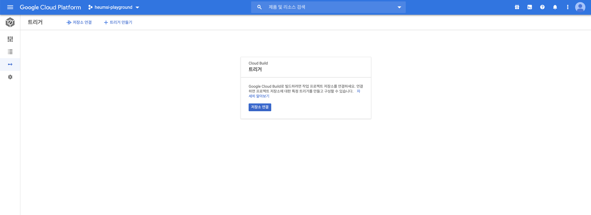

저장소 연결 버튼을 눌러, 저장소를 연결하면 된다.  
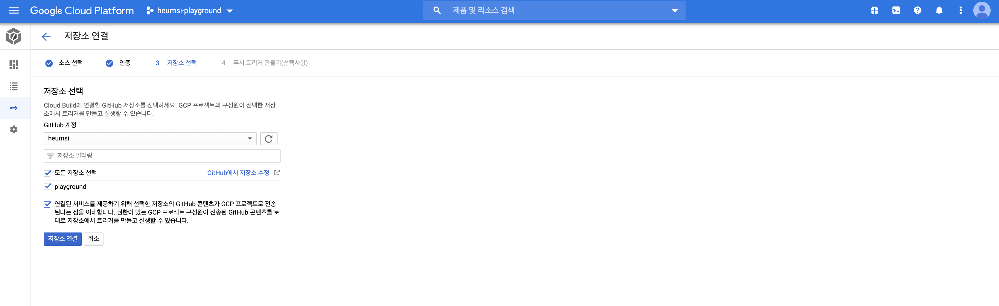

사실 이 부분은 그냥 UI 따라서 하나씩 따라가면 된다.
잘 완료했으면 깃허브 레포지토리에 연결된 것을 볼 수 있다.


## 5. cloud build - 트리거 만들기

Cloud 빌드 - 트리거 항목 페이지로 들어온다.
'위에서 트리거 만들기 버튼을 눌러, 트리거 생성 페이지로 들어온다.

먼저 CI 트리거부터 만들어보자.
나는 `master` 브랜치로 `Pull Request` 가 들어올 때 CI 가 동작하도록 하고 싶다.
즉, `Pull Request` 에 포함된 코드가, `black` 포매팅 체킹을 통과하는지 보고 싶은 것이다.

다음과 같이 입력하자.

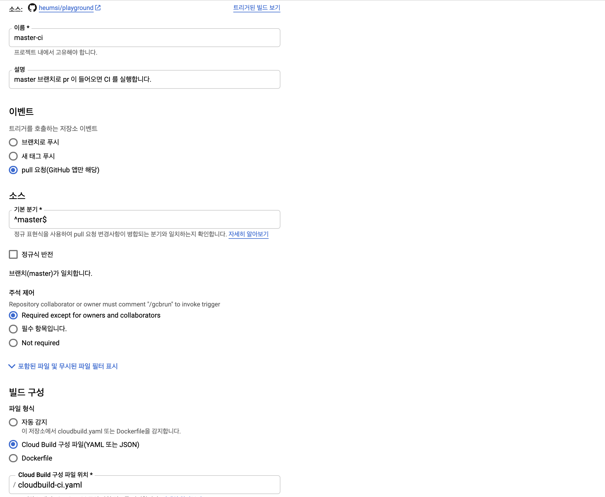

저장 버튼을 누르고, 만들기를 완료하자.

그 다음으로 CD 트리거를 만들어보자. 다시 트리거 만들기 버튼을 누르고 다음처럼 입력한다.

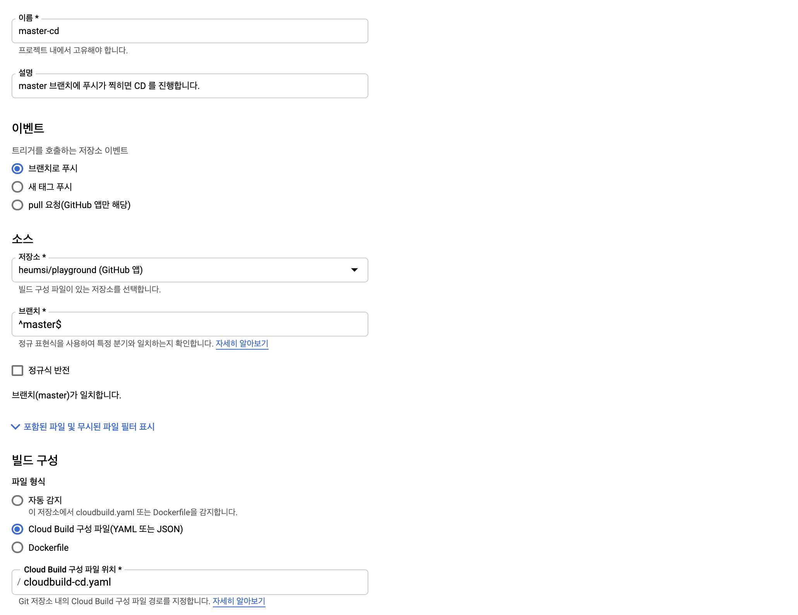


## 6. cloud build - 설정

cloud build 는 그 과정에서 GCP Container Registry, Cloud Run 을 사용하므로, 이에 대한 권한을 미리 주어야 한다.
cloud build 설정 페이지에서 다음 처럼 서비스 계정 권한을 주자.

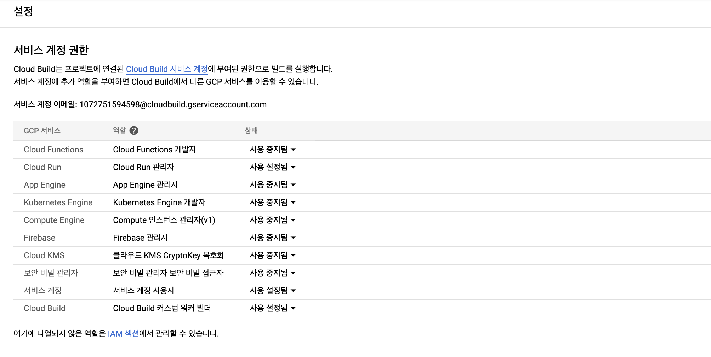

- Cloud Run
- 서비스 계정
- Cloud Build

 이 3가지 항목을 `사용 설정됨` 으로 바꿔주면 된다.


## 7. 테스트

이제 정말 잘 도는지 테스트 해보자.


### CI 테스트

먼저 `master` 브랜치에서  `test` 브랜치를 만든 뒤, `app.py` 코드 일부를 다음처럼 수정한다.

```bash
$ git checkout -b test 
```

```python
# app.py

from flask import Flask

app = Flask(__name__)

@app.route("/")
def hello_world():
    return "Hello, world!!!!!!!"  # 이 부분 수정 됨

if __name__ == "__main__":
    app.run(debug=True, host="0.0.0.0", port=5000)
```

저장 후, `origin test` 브랜치에 `push` 하자.

```bash
$ git add .                                                      
$ git commit -m "ci/cd 테스트"                     
$ git push origin test 
```

github 에서 `test` -> `master` 로 PR 을 날려본다.

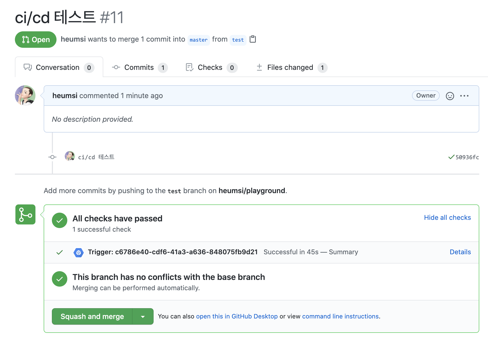

**All checks have passed** 가 뜨면서, GCP cloud build 가 동작한 것을 확인할 수 있다.
Details 부분을 누른 뒤, View more details on Google Cloud Build 을 클릭하면 다음과 같이 파이프라인 과정도 볼 수 있다.

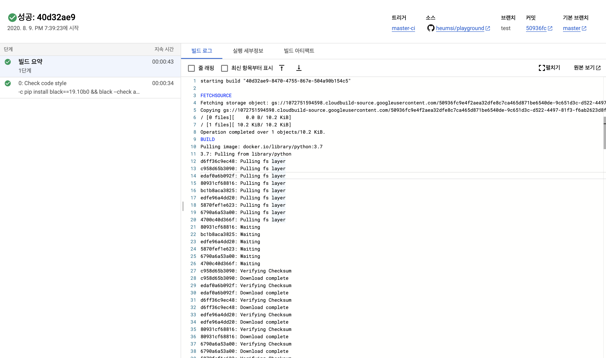


### CD 테스트

이제 이 PR 을 `merge` 하자.
 `master` 브랜치에 `push` 가 찍힘으로서, 트리거에 의해 CD가 작동하게 된다.

이 부분은 GCP - Cloud 빌드 - 기록에 가면 확인할 수 있다.

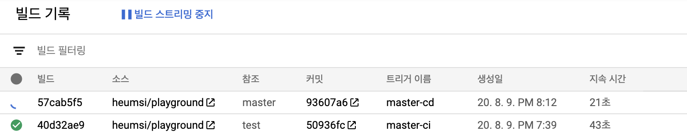 


마찬가지로 `57cab5f5` 부분을 누르면 다음 처럼 빌드 과정이 쭈욱 나오고...

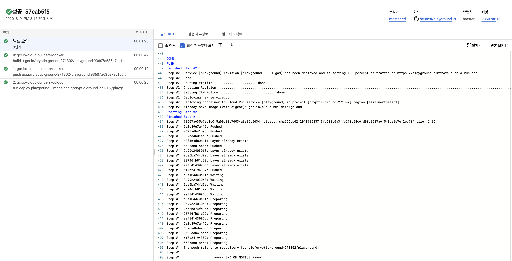


GCP - Cloud Run 에 가면 다음처럼 배포된 인스턴스가 생긴 것을 볼 수 있다.

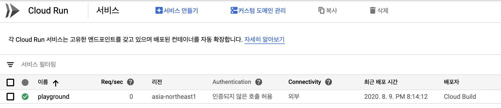


해당 인스턴스를 클릭을 통해 들어가면, 다음 페이지가 등장한다.

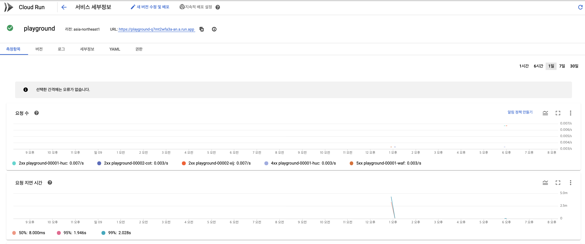


상단에 이 인스턴스에 접근 가능한 url 이 떠 있는데, 브라우저로 직접 들어가보면, 다음 처럼 의도한 대로 잘 나오는 것을 볼 수 있다.


## 8. 나가며

GCP Cloud Build는 GCP가 제공하는 몇 가지 리소스만으로 간단하게 CI/CD 파이프라인을 세울 수 있는 서비스다.  
너무 간단한 예제를 다뤄서 그런지, 몇 분만에 그냥 간단하게 만들어볼 수 있었다.

엔터프라이즈급에서 어떻게 사용할 지 아직 잘은 모르겠지만, 일단 GCP 에서 개인 토이프로젝트 하는 분들에게는 아주 유용하게 쓰일 수 있을 거 같다는 생각이 든다.

