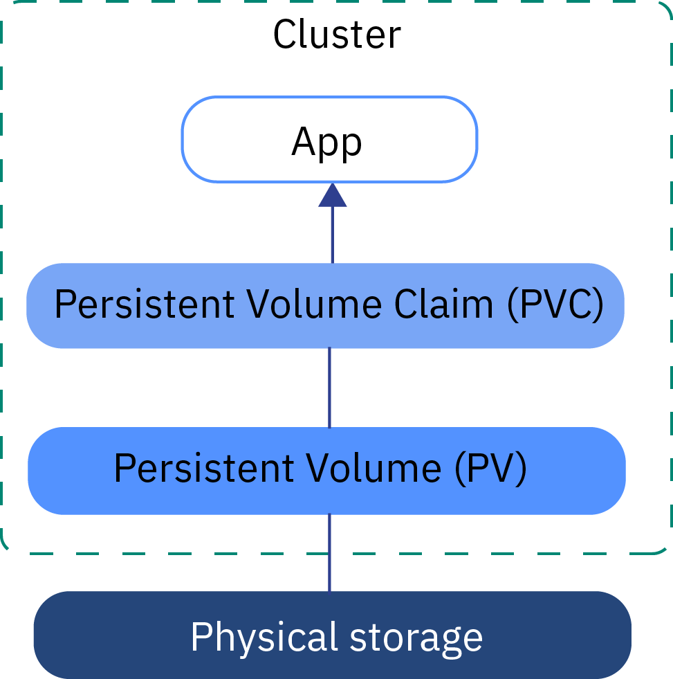

# PV, PVC

### 개념 이해

- 애플리케이션 개발자가 스토리지 기술의 종류를 몰라도 상관없도록 하는 것.
- 관리자의 영역과 사용자(개발자)의 영역을 나눔.
- 구체적인 볼륨이 무엇인지 몰라도, 사용자가 쓸 수 있도록 추상화 한 것.
- pv : persistent volume - 주로 관리자가 작성
- pvc: persistent volume claim (요청) - 주로 개발자가 작성



*출처: https://cloud.ibm.com/docs/containers?topic=containers-kube_concepts&locale=pt*


### PV

인프라 관리자가 사전에 미리 PV 를 작성.

```yaml
apiVersion: v1
kind: PersistentVolume
metadata:
  name: mongo-pv
spec:
  capacity:
    storage: 10Gi
  volumeMode: Filesystem
  accessModes:
    - ReadWriteOnce
    - ReadOnlyMany
  persistentVolumeReclaimPolicy: Retain
  gcePersistentDisk:  # volume으로 gcePersistentDisk 타입 사용
    pdName: mongodb
    fsType: ext4
```


### PVC와 Pod

PV를 사용하겠다는 PVC와 이 PVC를 사용하는 Pod를 작성

```yaml
apiVersion: v1
kind: PersistentVolumeClaim
metadata:
  name: mongo-pvc
spec:
  accessModes:
    - ReadWriteOnce
  resources:
    requests:
      storage: 10Gi
  storageClassName: ""

---

apiVersion: v1
kind: Pod
metadata:
  name: mongodb
spec:
  containers:
  - image: mongo
    name: mongodb
    volumeMounts:
    - mountPath: /data/db
      name: mongodb
  volumes:
  - name: mongodb
    persistentVolumeClaim:
      claimName: mongo-pvc  # 위에서 작성한 pvc 사용
```

이렇게 생성된 이후 다음 명령어로 PV, PVC 확인 가능 

```bash
$ kubectl get pv
$ kubectl get pvc
```


### PV 동적 프로비저닝

PV를 직접 만드는 대신 사용자가 원하는 PV 유형을 선택하도록 오브젝트(StorageClass) 정의 가능.
PV 동적 프로비저닝을 사용하면, 사용할 디스크와 PV가 자동으로 생성됨.

먼저 StorageClass 작성

```yaml
apiVersion: storage.k8s.io/v1
kind: StorageClass
metadata:
  name: storage
provisioner: kubernetes.io/gce-pd
parameters:
  type: pd-ssd
```

이 StorageClass를 사용할 PVC 작성

```yaml
apiVersion: v1
kind: PersistentVolumeClaim
metadata:
  name: mongo-pvc
spec:
  accessModes:
    - ReadWriteOnce
  resources:
    requests:
      storage: 10Gi
  storageClassName: "storage"  # 여기에 StorageClass 리소스 이름을 적어준다. 
```

이제 Bind가 되면, PVC에 따라 PV가 동적으로 생성됨.

다음 명령어로 StorageClass 조회 가능

```bash
$ kubectl get sc
```

