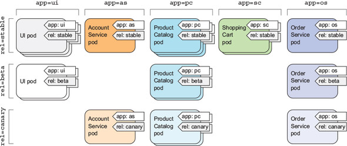

## 큐브 시스템 컴포넌트

### 큐브 API 서버

- 쿠버네티스 시스템 컴포넌트는 오직 API 서버와 통신
- 컴포넌트끼리 직접 통신 X
- 때문에 etcd와 통신하는 유일한 컴포넌트 API 서버
- RESTful API를 통해 클러스터 상태를 쿼리, 수정할 수 있는 기능 제공
- API 서버의 구체적인 역할
    - 인증 플러그인을 사용한 클라이언트 인증
    - 권한 승인 플러그인을 통한 클라이언트 인증
    - 승인 제어 플러그인을 통해 요청 받은 리소스를 확인/수정
    - 리소스 검증 및 영구 저장


### 큐브 컨트롤러 매니저

- 컨트롤러에는 다양한 컨트롤러가 존재
    - ex. 레플리케이션 매니저, 레플리카 셋/ 데몬셋/ 잡 컨트롤러 등등
    - 이 컨트롤러는 API에 의해 받아진 요청을 처리하는 역할 


### 큐브 스케쥴러

- 요청 받은 리소스를 어느 노드에 실행할지 결정하는 역할 
- 현재 노드의 상태를 점검하고 최상의 노드를 찾아 배치
- 다수의 포드를 배치하는 경우에는 라운드 로빈을 사용하여 분산


### etcd

- multi key-value 데이터베이스
- 쿠버네티스 구성에 필요한 데이터들을 담고 있음.
    - ex. `/registry/clusterrolebindings/cluster-admin`


## Pod

- 쿠버네티스에서는 컨테이너가 아닌 포드가 기본 단위
- 노드는 포드를 담고, 포드는 컨테이너를 담음.
- 하나의 포드는 밀접한 관계를 맺는 컨테이너들만을 담도록 하는 것이 권장됨.
    - ex. 프론트엔드 컨테이너와 백엔드 컨테이너를 하나의 포드에 담는 것 x
    - ex. 백엔드 컨테이너와 로그 시스템 컨테이너를 하나의 포드에 담는 것 o
    - 각각 스케일링이 가능하도록 하게 위함.


### 포드의 정의 구성 요소

- apiVersion: 쿠버네티스 api의 버전
- kind: 어떤 리소스 유형인지 결정 (레플리카 컨트롤러, 서비스 등)
- 메타 데이터 (포드와 관련된 이름, 네임 스페이스, 라벨 그밖의 정보 존재)
- 스펙: 컨테이너, 볼륨 등의 정보
- 상태: 포드의 상태, 정보 등
    - 상태는 사용자가 직접 입력하지 않고, 쿠버네티스 시스템이 입력함.


### 간단한 Pod 생성 및 관련 명령어 

```yaml
# go-http-pod.yaml

apiVersion: v1
kind: Pod
metadata:
    name: go-http
spec:
    containers:
    - name: go-http
      image: heumsi/go-tutorial-app
      ports:
      - containerPort: 8080
```

```bash
# yaml 파일로부터 pod 생성
$ kubectl create -f go-http-pod.yaml

# pod 상세 설명 보기
$ kubectl describe pod go-http

# pod을 yaml 파일 형태로 보기
$ kubectl get pod go-http -o yaml

# pod을 로컬에서 포트 포워딩하기
$ kubectl port-foward go-http 8080:8080

# 일반적인 pod과 관련된 설명 보기
$ kubectl explain pods

# pod 로그 보기
$ kubectl logs go-http

# 주석 달기 (yaml 내 metadata.annotations에 값이 들어감.)
$ kubectl annotate pod go-http test1234=test1234

# yaml 파일로부터 생성된 pod 삭제
$ kubectl delete -f go-http-pod.yaml

# pod 이름으로 pod 삭제
$ kubectl delete pod go-http

# 모든 pod 삭제
$ kubectl delete pod --all
```


### Liveness, Readiness and Startup Probes

- Liveness Probe
    - **컨테이너가 살았는지 판단**하고 다시 시작하는 기능
    - 컨테이너의 상태를 스스로 판단하여 교착 상태에 빠진 **컨테이너를 재시작**
- Readiness Probe
    - **포드가 준비된 상태에 있는지 확인**하고 정상 서비스를 시작하는 기능
    - 포드가 적절하게 준비되지 않은 경우, **로드 밸런싱(서비스)을 하지 않음.**
- Startup Probe
    - **애플리케이션의 시작 시기를 확인**하여 가용성을 높임.
    - 이 때 동안, Liveness와 Readiness 기능 비활성화 (이 이후에 실행됨)
    - 프로그램의 실행이 긴 경우 유용 (실행 중에 이상이 없는지 점검)

#### Liveness 커맨드 설정 - 파일 존재 여부 확인

- 리눅스 커맨드 실행 후 반환 값으로 판단

```yaml
apiVersion: v1
kind: Pod
metadata:
  labels:
    test: liveness
  name: liveness-exec
spec:
  containers:
    - name: liveness
      image: k8s.gcr.io/busybox
      args:
        - /bin/sh
        - -c
        - touch /tmp/healthy; sleep 30; rm -rf /tmp/healthy; sleep 600
      livenessProbe:
        # cat /tmp/heathy 실행. 
        # 커맨드 실행 성공 시 0 반환, 실패 시 0 이외 값 반환 
        exec:
          command:
            - cat
            - /tmp/healthy
        initialDelaySeconds: 5  # Pod이 정상 실행되고 5초 뒤부터 livenessProbe 동작
        periodSeconds: 5  # 5초 뒤 동작 후, 5초마다 점검
```


#### Liveness 웹 설정 - http 요청 확인

- 서버 응답 코드로 판단 

```yaml
apiVersion: v1
kind: Pod
metadata:
  labels:
    test: liveness
  name: liveness-http
spec:
  containers:
    - name: liveness
      image: k8s.gcr.io/liveness
      args:
        - /server
      livenessProbe:
        # GET /healthz 요청
        # 정상 작동 시 응답 코드가 200이상 400미만 반환, 실패 시 그 외 코드 반환
        httpGet:
          path: /healthz
          port: 8080
          httpHeaders:
            - name: Custom-Header
              value: Awesome
        initialDelaySeconds: 3
        periodSeconds: 3
```


#### Liveness, Readness TCP 설정 - 포트 검사

```yaml
apiVersion: v1
kind: Pod
metadata:
  name: goproxy
  labels:
    app: goproxy
spec:
  containers:
    - name: goproxy
      image: k8s.gcr.io/goproxy:0.1
      ports:
        - containerPort: 8080
      readinessProbe:  # 성공 시, 서비스 시작해도 된다고 알리는 역할.
        tcpSocket:
          port: 8080  # 8080 포트 검사
        initialDelaySeconds: 5  # Pod 뜨고 5초 뒤부터 검사
        periodSeconds: 10  # 시작 이후 10초 주기로 검사
      livenessProbe:  # 성공 시, 컨테이너 재시작하지 않아도 됨.
        tcpSocket:
          port: 8080
        initialDelaySeconds: 15
        periodSeconds: 20
```


#### Startup Probe 웹 설정 - http 요청 확인

```yaml
ports:
- name: liveness-port
  containerPort: 8080
  hostPort: 8080

livenessProbe:
  httpGet:
    path: /healthz
    port: liveness-port
  failureThreshold: 1
  periodSeconds: 10

startupProbe:  # 시작할 때까지 검사를 수행
  httpGet:  # http 요청을 통해 검사
    path: /healthz
    port: liveness-port
  failureThreshold: 30  # 30번을 검사하며 
  periodSeconds: 10  # 10초 간격으로 검사함.
  # 즉 300초 동안 포드가 정상 실행되는 시간을 벌어줌.
```

 

### 레이블과 셀렉터

- 레이블은 포드를 인식하기 위한 바코드
    - 키-밸류 쌍
- 레이블 셀렉터를 사용하면 각종 리소스를 필터링하여 선택할 수 있음.
- 모든 사람이 쉽게 이해할 수 있는 체계적인 시스템을 구축 가능
    - App: 애플리케이션 구성요소, 마이크로 서비스 유형 지정
    - Rel: 애플리케이션의 버전 지정



*출처: https://livebook.manning.com/book/kubernetes-in-action/chapter-3/134*


다음과 같이 `.yaml` 내에 `metadata.labels` 안에 label 선언하면 된다.

```yaml
apiVersion: v1
kind: Pod
metadata:
  name: label-demo
  labels:
    environment: production  # key:value 형태로 적어준다.
    app: nginx
spec:
  containers:
  - name: nginx
    image: nginx:1.14.2
    ports:
    - containerPort: 80
```

그 외 다음과 같은 커맨드 명령들이 있다.

```bash
# 새로운 레이블을 추가해야할 때
$ kubectl label pod label-demo foo=bar

# 기존 레이블을 수정해야할 때
$ kubectl label pod label-demo foo=bar --overwrite

# 기존 레이블을 삭제해야할 때
$ kubectl label pod label-demo foo-

# 레이블 보여주기
$ kubectl get pod --show-labels

# 특정 레이블 컬럼으로 확인
$ kubectl get pod -L app, rel

# 레이블로 필터링하여 검색
$ kubectl get pod --show-labels -l 'env'  
$ kubectl get pod --show-labels -l '!env'  
$ kubectl get pod --show-labels -l 'env!=test'
$ kubectl get pod --show-labels -l 'env!=test,rel=beta'
```

> Pod의 Label 전략은 다음 아티클을 참고하자.  
> [9 Best Practices and Examples for Working with Kubernetes Labels](https://www.replex.io/blog/9-best-practices-and-examples-for-working-with-kubernetes-labels)


## ReplicaSet

현재 쿠버네티스 버전에서는 레플리케이션 컨트롤러가 사라짐. (레플리카 셋으로 통합됨.) 


### 레플리케이션 컨트롤러

- 포드가 항상 실행되도록 유지하는 쿠버네티스 리소스
- 노드가 클러스터에서 사라지는 경우, 해당 포드를 감지하고 대체 포드 생성
- 실행 중인 포드의 목록을 지속적으로 모니터링하고, 실제 포드 수가 원하는 수와 항상 일치하는지 확인
- Pod이 장애가 발생한 경우, 5분 뒤 해당 Pod을 내리고 새로운 Pod 생성
    - 5분은 기본 설정 값임 (수정가능).
    - 일시적 장애일 수 있기 때문에 5분이라는 유예 시간을 주는 것. (5분이 아니라 즉각즉각 생성하면 Pod 과다 생성할 수 있음. 이를 방지하는 것)